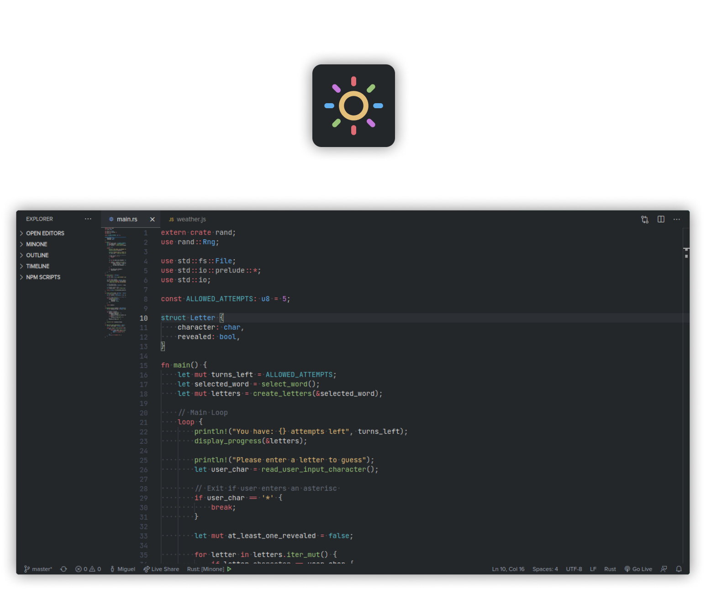

<h1>Minone</h1>
<b>🌻 Comfortable & Pleasant Color Scheme for Visual Studio Code</b>

> Based one [One Dark Pro](https://github.com/Binaryify/OneDark-Pro)

## Features

-   **Minimalist** design and use of the colors.
-   **One Dark Pro** based theme.
-   **Terminal** colors and theme.

## Installation

The theme is available in the [VSCode Marketplace](https://marketplace.visualstudio.com/items?itemName=miguelravila.minone)

## Colors

  

